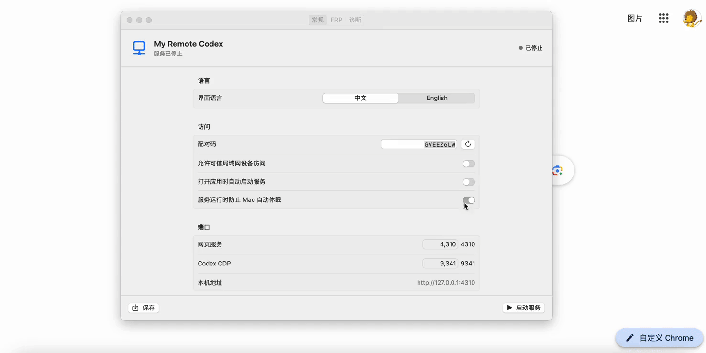

# My Remote Codex

My Remote Codex 让你通过手机或其他电脑远程查看和控制 Mac 上运行的 Codex，随时掌握任务进度并补充指令。远程设备只需打开浏览器，无需登录 OpenAI 账号，也无需安装 ChatGPT 手机应用。

## 核心能力

- 浏览器显示 Codex 的真实画面，不维护仿制页面。
- 支持电脑和手机的鼠标、触摸、键盘、输入及任务执行中补充指令。
- macOS 优先使用 H.264/WebRTC 低延迟画面，并自动回退 JPEG。
- 提供配对码、会话认证、输入限速。
- 支持可信局域网、内网穿透，以及基于认证与访问控制的 `FRP v0.71.0` 自托管接入。

## 演示



## 快速开始

需要 macOS，并已安装官方 Codex 桌面客户端。推荐使用 DMG；开发或从源码运行时再使用 Shell。

### DMG 安装（推荐）

1. 打开 DMG，将 `My Remote Codex.app` 拖入“应用程序”并启动。
2. 如果 macOS 阻止首次启动，请打开“系统设置”→“隐私与安全性”，找到有关 `My Remote Codex.app` 的安全提示并点击“仍要打开”，然后在确认对话框中再次点击“仍要打开”。
3. 开启“允许可信局域网设备访问”。
4. 点击“启动服务”，在界面中查看访问地址和配对码。
5. 在手机或其他电脑的浏览器中打开访问地址，输入配对码。

DMG 已内置运行环境和 `frpc`，不需要安装 Node.js，也不需要执行项目中的 Shell 脚本。

### Shell 启动

适合开发或从源码运行，需要 Node.js 22 或更高版本。首次使用执行：

```bash
npm install
npm run build:native:macos
npm run build
```

正常退出 Codex 后，启动 Codex 和网页服务：

```bash
./scripts/launch-codex-macos.sh
REMOTE_CODEX_ALLOW_INSECURE_HTTP=true REMOTE_CODEX_HOST=0.0.0.0 npm start
```

在其他设备的浏览器中打开终端显示的地址，并输入配对码。

> 局域网明文 HTTP 只适用于完全可信且隔离的网络。CDP 必须只监听本机回环地址，禁止把 `9341` 端口暴露到局域网或公网。

## FRP 公网访问

只有跨网络访问时才需要配置 FRP。DMG 和 Shell 共用同一个 FRP 服务端，但 Mac 端的配置方式不同：DMG 直接在应用中配置；Shell 才需要执行客户端脚本。

### 1. 部署 FRP 服务端

准备一台带公网 IPv4、systemd 和 Caddy 的 Linux 服务器。以下示例使用 [sslip.io](https://sslip.io/) 和公网 IP `11.22.33.44`，实际部署时替换为自己的服务器 IP：

- FRP 入口：`frp.11-22-33-44.sslip.io`
- 浏览器入口：`device-01.11-22-33-44.sslip.io`

在服务器的项目目录执行：

```bash
sudo ./scripts/setup-frp.sh server \
  --frp-host frp.11-22-33-44.sslip.io \
  --base-domain 11-22-33-44.sslip.io \
  --device device-01
```

脚本会配置 `frps v0.71.0`、TLS、systemd 和 Caddy，并生成凭据目录 `/root/my-remote-codex-device-01`。服务器需要开放 TCP `80`、`443`、`7000`。

### 2. 在 Mac 上连接

根据安装方式二选一。

#### 使用 DMG

1. 将服务器生成的凭据目录安全地复制到 Mac。
2. 打开应用的“FRP”页，开启“FRP 自托管隧道”。
3. 根据 `metadata.env` 填写服务器、端口、设备 ID、用户和子域。
4. 选择 `frp-ca.crt`，填入 `frp-token` 和 `gateway-token` 的内容。
5. 保持 TLS 为“验证服务器”，保存后点击“启动服务”。

到此即可。DMG 会使用内置的 `frpc` 启动隧道，Mac 上不需要执行 `setup-frp.sh local`、`setup-frp.sh start` 或 `launch-codex-macos.sh`。

#### 使用 Shell

将服务器生成的凭据复制到 Mac，再导入并启动：

```bash
scp -r root@11.22.33.44:/root/my-remote-codex-device-01 .
./scripts/setup-frp.sh local --bundle ./my-remote-codex-device-01
./scripts/launch-codex-macos.sh
./scripts/setup-frp.sh start
```

`local` 命令会安装 `frpc v0.71.0` 并生成 `.env.frp`。使用 `./scripts/setup-frp.sh status` 查看运行状态。

非标准 HTTPS 端口、证书要求和排障步骤见 [FRP 自托管部署](docs/frp-self-hosting.md)。

## 文档

- [用户指南：操作、配置、故障排查、安全边界与实机验证](docs/user-guide.md)
- [FRP 自托管部署：服务器、Mac、非标准 HTTPS 端口与排障](docs/frp-self-hosting.md)
- [macOS 安装版：配置应用、DMG、签名与公证](docs/macos-installer.md)

## 说明

项目通过 Chrome DevTools Protocol 获取 Codex 的真实渲染画面并转发受限输入事件。这是实验性开源工具，不是 OpenAI 官方插件；Codex 更新后可能需要同步适配。

## 许可证

本项目采用 [MIT License](LICENSE) 开源。
